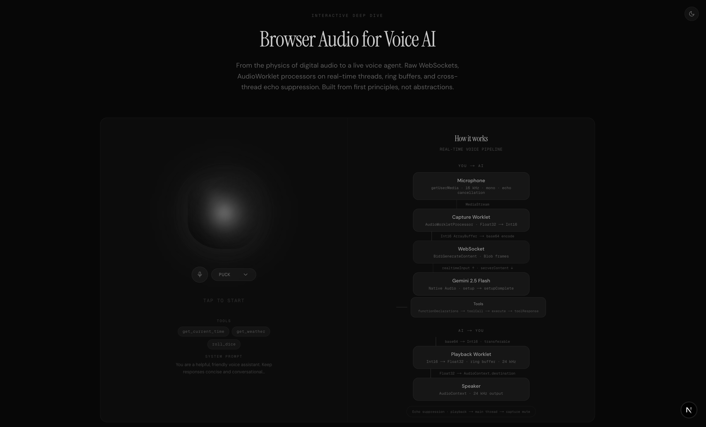

# Browser Audio for Voice AI

An interactive deep dive into browser audio architecture for voice AI. From the physics of digital audio to a live voice agent, built from first principles.



**[Live Demo](https://interactive-browser-audio-voice-ai.vercel.app)** (coming soon)

## What This Is

An interactive article that teaches browser audio internals through a working voice AI demo. The left panel is a live Gemini-powered voice agent. The right panel visualizes the internal audio pipeline in real time. The article below covers everything from sample rates to ring buffers.

Topics covered:

- Digital audio fundamentals (sample rate, bit depth, PCM encoding)
- Browser thread model and why AudioWorklet exists
- Render quantum, AudioContext as a directed graph
- Mic capture with getUserMedia and AudioWorklet processors
- Three-thread architecture (main, capture, playback)
- Ring buffers with monotonic write/read indices for gapless playback
- Browser AEC (echo cancellation) with Gemini server-side VAD for barge-in
- Float32 to Int16 PCM conversion
- WebSocket transport to Gemini Live API (BidiGenerateContent)
- S2S vs Chained Pipeline architectures
- Latency budgets and VAD (Voice Activity Detection)

## Architecture

```
 Microphone
     |
 getUserMedia (mono, 16kHz)
     |
 AudioWorklet (capture-processor)    <-- dedicated rendering thread
     | port.postMessage
 Main Thread
     | base64 encode
 WebSocket -----> Gemini Live API (BidiGenerateContent)
     |
 base64 decode
     | port.postMessage
 AudioWorklet (playback-processor)   <-- dedicated rendering thread
     |
 AudioContext.destination (speakers, 24kHz)
```

Two separate AudioContexts run at different sample rates: 16kHz for capture (speech-optimized) and 24kHz for playback (Gemini's output format). The playback worklet uses a ring buffer to absorb network jitter and produce gapless audio.

## Tech Stack

- **Next.js 16** with React 19 and Tailwind CSS v4
- **Gemini Live API** via raw WebSocket (BidiGenerateContent)
- **AudioWorklet** processors for real-time audio on dedicated threads
- **Motion** (Framer Motion) for animations
- **Radix UI** primitives with shadcn/ui components
- **next-themes** for dark/light mode

## Getting Started

### Prerequisites

- Node.js 18+
- pnpm
- A [Gemini API key](https://aistudio.google.com/apikey)

### Setup

```bash
git clone https://github.com/HrushiBorhade/interactive-browser-audio-voice-ai.git
cd interactive-browser-audio-voice-ai
pnpm install
```

Create a `.env.local` file:

```
GEMINI_API_KEY=your_gemini_api_key_here
```

### Development

```bash
pnpm dev
```

Open [http://localhost:3000](http://localhost:3000).

### Build

```bash
pnpm build
pnpm start
```

## Project Structure

```
src/
  app/
    layout.tsx          # Root layout with fonts and metadata
    page.tsx            # Main page with voice UI demo
    globals.css         # Global styles and Tailwind
    api/voice/token/    # API route to proxy Gemini API key
  components/
    article-content.tsx # The full interactive article
    voice-orb.tsx       # Animated voice state orb
    architecture-flow.tsx # Real-time pipeline visualization
    theme-provider.tsx  # Dark/light theme provider
    ui/                 # shadcn/ui primitives
  hooks/
    use-gemini-live.ts  # WebSocket + AudioWorklet orchestration
  lib/
    tools.ts            # Demo tool declarations (time, weather, dice)
    utils.ts            # Utility functions
public/
  capture-worklet.js    # AudioWorklet processor for mic capture
  playback-worklet.js   # AudioWorklet processor with ring buffer
```

## How the Voice Demo Works

1. Click the mic button to connect
2. The app fetches an API token, sets up two AudioContexts, loads AudioWorklet processors, and opens a WebSocket to Gemini
3. Mic audio flows through the capture worklet (16kHz mono PCM), gets base64-encoded, and streams to Gemini via WebSocket
4. Gemini responds with audio chunks that get decoded and fed into the playback worklet's ring buffer
5. The mic stays open during playback — browser AEC strips echo, and Gemini's server-side VAD detects interruptions (barge-in) to let you interrupt mid-sentence
6. Tool calls (time, weather, dice) are handled client-side and responses sent back to Gemini

## Author

**Hrushi Borhade** - [@HrushiBorhade](https://github.com/HrushiBorhade)

## License

MIT
